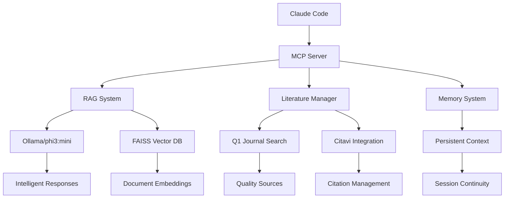

# 🤖 AI Finance Master's Thesis Research System

[](LICENSE)
[](https://python.org)
[](https://docker.com)
[](https://ollama.ai)
[]()

> **Automated Research Environment for Master's Thesis on AI Agents in Finance**  
> *"Agile Process Automation and Knowledge Management through AI Agents: Innovation Potential of SAP Business Technology Platform in Financial Services"*

## 🎯 Project Overview

This is a comprehensive research automation system designed specifically for a Master's thesis on AI agents in the financial sector. The system integrates literature search, RAG-based document analysis, and academic writing tools to accelerate research and ensure academic quality standards.

### 🏗️ Core Architecture



### ✨ Key Features & Benefits

- **🔍 Intelligent Literature Search**: Automated Q1 journal discovery with impact factor validation
- **📚 RAG-Powered Document Analysis**: CPU-optimized retrieval with Ollama/phi3:mini integration
- **📝 Academic Writing Assistant**: Structured templates following German MBA standards
- **🔗 Citation Management**: Automated Citavi integration with APA7 formatting
- **💾 Persistent Memory**: Context preservation across Claude Code sessions
- **🎓 Quality Assurance**: Built-in validation for academic standards and citation quality
- **🐳 Docker Infrastructure**: Self-contained environment with PostgreSQL, Redis, Qdrant

## 🚀 Quick Start

### Prerequisites

- **System**: Linux/WSL2 with Ubuntu 22.04+
- **Memory**: 16 GB RAM (32 GB recommended for large document sets)
- **Python**: 3.10+ with pip
- **Docker**: Latest version with docker-compose
- **Optional**: Git for version control

### 1. Installation

```bash
# Clone the repository
git clone <repository-url>
cd masterarbeit-ki-finance

# Create virtual environment
python3 -m venv venv
source venv/bin/activate

# Install dependencies (CPU-optimized)
pip install -r requirements.txt --constraint constraints.txt

# Install Ollama for intelligent responses (optional but recommended)
curl -fsSL https://ollama.ai/install.sh | sh
ollama serve &
ollama pull phi3:mini  # 2.2 GB, CPU-optimized model
```

### 2. Initialize Project

```bash
# Setup directories and models
cd scripts && ./setup_research.sh

# Start Docker services
docker-compose up -d

# Initialize memory system
python memory_system.py init
```

### 3. MCP Integration with Claude Code

```bash
# Add MCP server to Claude Code
claude mcp add masterarbeit-finance ./start_mcp_server.sh

# Or use direct integration
./install_mcp_claude.sh
```

## 📖 Usage Examples

### 🔬 Research Workflow: PRISMA Literature Review

```bash
# 1. Search Q1 journals for PRISMA methodology
python scripts/search_literature.py \
  --query "PRISMA framework systematic literature review" \
  --databases "IEEE Xplore,ACM Digital Library,ScienceDirect" \
  --years "2020-2025" \
  --quality "q1"

# Result: 15 relevant papers found
```

### 📄 Document Analysis with RAG

```bash
# 2. Index downloaded PDFs
python scripts/rag_system.py index \
  --path literatur/methodik/ \
  --cpu-only

# 3. Intelligent search with context
python scripts/rag_system.py search \
  "PRISMA checklist items systematic review methodology" \
  --top-k 5

# AI Response with Ollama:
{
  "answer": "The PRISMA 2020 Framework defines a 27-item checklist for systematic reviews...",
  "sources": [{
    "citation": "(Page et al., 2021, p. 3)",
    "context": "The checklist items guide authors through..."
  }]
}
```

### ✍️ Academic Writing Integration

```bash
# 4. Generate structured content
python scripts/research_assistant.py template \
  --chapter "Methodik" \
  --section "Systematische Literaturanalyse" \
  --citations "Page2021,Moher2020"

# 5. Citation quality control
python scripts/citation_quality_control.py verify \
  --text "Die systematische Literaturanalyse folgt dem PRISMA-Framework" \
  --source "Page et al. 2021"

# Output: "Die systematische Literaturanalyse folgt dem PRISMA-Framework (Page et al., 2021, S. 3)"
```

### 📊 Memory System for Context Persistence

```bash
# Store research context
python -c "from memory_system import get_memory; get_memory().add_note('PRISMA methodology validated')"

# Retrieve session context
python -c "from memory_system import get_memory; print(get_memory().get_context())"

# Create progress checkpoint
python -c "from memory_system import get_memory; get_memory().create_checkpoint('literature_review_complete')"
```

## ⚙️ Configuration

### Key Configuration Files

| File | Purpose | Key Settings |
|------|---------|--------------|
| `config/research-criteria.yaml` | Literature quality standards | Q1 journals, impact factors, publication years |
| `config/rag_config.yaml` | RAG system parameters | Model: phi3:mini, CPU-only mode |
| `config/writing-style.yaml` | German MBA standards | Citation style: APA7, academic formatting |
| `config/mba-standards.json` | Quality criteria | Evaluation rubrics, deadlines |
| `.claude_memory/` | Persistent context | Session history, research notes |

### Environment Variables

```bash
# Create .env file (not in git)
cp .env.example .env

# Required for API access
SCOPUS_API_KEY=your_scopus_key
WOS_API_KEY=your_wos_key
CROSSREF_EMAIL=your.email@university.edu
```

## 🏗️ Architecture & Components

### System Components

```
├── 🧠 Core Services
│   ├── MCP Server (Claude Code integration)
│   ├── RAG System (Document intelligence)
│   ├── Memory System (Context persistence)
│   └── Quality Control (Academic standards)
│
├── 📚 Research Tools
│   ├── Literature Search (Q1 journal discovery)
│   ├── Reference Manager (Citavi integration)
│   ├── Citation Control (APA7 formatting)
│   └── Progress Tracking (Milestone management)
│
├── 🐳 Infrastructure
│   ├── Ollama (LLM inference)
│   ├── FAISS (Vector search)
│   ├── PostgreSQL (Structured data)
│   └── Redis (Caching)
│
└── 🎓 Academic Features
    ├── MBA Quality Checker
    ├── PRISMA Compliance
    ├── Citation Validation
    └── Progress Dashboard
```

### AI/ML Workflows

1. **Document Ingestion**: PDF → Text extraction → Chunking → Embeddings → Vector DB
2. **Intelligent Retrieval**: Query → Embedding → Vector search → Context ranking
3. **AI Response Generation**: Context + Query → Ollama/phi3:mini → Structured answer
4. **Citation Integration**: Source validation → APA7 formatting → Quality control

## 🔧 Development Setup

### Running Tests

```bash
# Full test suite
pytest tests/ -v

# RAG system self-test
python scripts/rag_system.py test --self-test

# MBA quality validation
python tests/test_mba_quality.py

# Code formatting
black scripts/*.py
```

### Docker Services

```bash
# Start all services
docker-compose up -d

# View logs
docker-compose logs -f ollama mcp-server

# Health checks
curl http://localhost:11434/api/tags  # Ollama
curl http://localhost:3001/health     # MCP Server
```

### Performance Monitoring

```bash
# System resources
python -c "import psutil; print(f'RAM: {psutil.virtual_memory().percent}%')"

# Ollama status
ollama list
curl -s http://localhost:11434/api/version

# RAG system statistics
python scripts/rag_system.py stats
```

## 📊 API Documentation

### MCP Tools for Claude Code

The system provides specialized MCP tools for seamless integration with Claude Code:

#### Literature Management
- `search_literature` - Q1 journal database search
- `manage_references` - Citavi integration and export
- `verify_citations` - Citation quality control

#### Document Intelligence
- `rag_search` - RAG-powered document search
- `analyze_document` - PDF content analysis
- `extract_citations` - Automatic citation extraction

#### Academic Writing
- `create_writing_template` - Structured chapter templates
- `quality_check` - MBA standards validation
- `progress_update` - Milestone tracking

### REST API Endpoints

```bash
# Health check
GET /health

# Literature search
POST /api/search
{
  "query": "AI agents finance",
  "databases": ["scopus", "wos"],
  "quality": "q1"
}

# RAG search
POST /api/rag/search
{
  "query": "PRISMA methodology",
  "top_k": 5,
  "use_llm": true
}
```

## 🧪 Testing & Validation

### Test Coverage

- **Unit Tests**: Core functionality validation
- **Integration Tests**: MCP server integration
- **Performance Tests**: RAG system benchmarks
- **Quality Tests**: Academic standards compliance

### Validation Checklist

- [ ] Literature search returns Q1 journals only
- [ ] Citations follow APA7 format
- [ ] RAG system provides accurate source attribution
- [ ] Memory system preserves context across sessions
- [ ] Ollama integration works with phi3:mini model

## 🚀 Deployment

### Production Deployment

```bash
# Build optimized Docker images
docker-compose -f docker-compose.prod.yml build

# Deploy with resource limits
docker-compose -f docker-compose.prod.yml up -d

# Configure reverse proxy (nginx)
sudo cp config/nginx.conf /etc/nginx/sites-available/masterarbeit
sudo ln -s /etc/nginx/sites-available/masterarbeit /etc/nginx/sites-enabled/
sudo systemctl reload nginx
```

### Performance Tuning

```bash
# Optimize for large document sets
export FAISS_OMP_NUM_THREADS=8
export PYTORCH_NUM_THREADS=16

# Memory optimization
echo 'vm.swappiness=10' | sudo tee -a /etc/sysctl.conf
sudo sysctl -p
```

## 🔧 Troubleshooting

### Common Issues

| Issue | Solution |
|-------|----------|
| CUDA not found | System automatically uses CPU versions (PyTorch+cpu, faiss-cpu) |
| Memory errors | Reduce `chunk_size` in `config/rag_config.yaml` |
| Ollama connection refused | Run `ollama serve &` before usage |
| Ollama command not found | Open new shell after installation or `export PATH=$PATH:/usr/local/bin` |
| Citavi not found | Set path in `config/api_keys.yaml` |

### Performance Optimization

```bash
# Clear model cache
rm -rf ~/.cache/huggingface/transformers/

# Rebuild search index
rm -rf indexes/ && python scripts/rag_system.py index --path literatur/ --cpu-only

# Monitor system resources
htop
docker stats
```

### Debugging

```bash
# Verbose logging
export PYTHONPATH=$PWD && python scripts/rag_system.py search "test" --verbose

# Memory system status
python memory_system.py status

# Docker service logs
docker-compose logs -f --tail=100
```

## 🤝 Contributing

### Adaptation for New Thesis Topics

**➡️ See [ANPASSUNG_NEUE_MASTERARBEIT.md](ANPASSUNG_NEUE_MASTERARBEIT.md) for complete adaptation guide!**

This template is configured for "AI Agents in Finance". For your own topic:

1. **Configuration Files** (~2-3 hours):
   - Update keywords in `config/research-criteria.yaml`
   - Modify thesis outline in `writing/thesis_outline.json`
   - Adjust quality criteria for your field
   - Configure university-specific requirements

2. **Content Templates**:
   - Customize writing templates in `writing/templates/`
   - Update theoretical frameworks
   - Adapt methodology sections

3. **Search Configuration**:
   - Add relevant databases for your field
   - Modify search keywords and exclusion criteria
   - Configure journal rankings specific to your discipline

### Development Guidelines

- Follow academic integrity standards
- Maintain citation accuracy
- Test RAG responses for factual correctness
- Document configuration changes
- Backup research data regularly

## 📜 License

This project is licensed for **Academic Use Only**. See [LICENSE](LICENSE) for details.

**Academic Integrity Notice**: This system is designed to assist with research and citation management. Users are responsible for:
- Verifying all citations and sources
- Ensuring compliance with university plagiarism policies
- Maintaining academic integrity in all generated content
- Properly attributing all sources according to academic standards

## 📞 Support & Resources

### 📖 Documentation

Comprehensive documentation is available in the `/docs` directory:

- **[Architecture Guide](docs/architecture.md)**: System design, components, and data flows
- **[API Reference](docs/api-reference.md)**: Complete API documentation with examples
- **[Deployment Guide](docs/deployment.md)**: Production deployment instructions
- **[Configuration Guide](docs/configuration.md)**: Detailed configuration options
- **[Development Guide](docs/development.md)**: Developer setup and contribution guidelines
- **[Troubleshooting Guide](docs/troubleshooting.md)**: Common issues and solutions

### 🤝 Getting Help

- **GitHub Issues**: [Report bugs and feature requests](https://github.com/your-repo/issues)
- **Documentation**: Check the `/docs` folder for detailed guides
- **University Support**: Contact your thesis supervisor for academic guidance
- **Technical Support**: See [troubleshooting guide](docs/troubleshooting.md) or create an issue

## 🔄 Recent Updates

- **v2.1.0**: Enhanced Ollama integration with phi3:mini model
- **v2.0.0**: Complete MCP server rewrite for Claude Code
- **v1.9.0**: Added MBA quality validation system
- **v1.8.0**: Implemented PRISMA compliance checking
- **v1.7.0**: Enhanced citation quality control

---

**Last Updated**: August 2025 | **Status**: Active Development | **Python**: 3.10+ | **License**: Academic Use

⭐ **Star this repository** if it helps with your research!