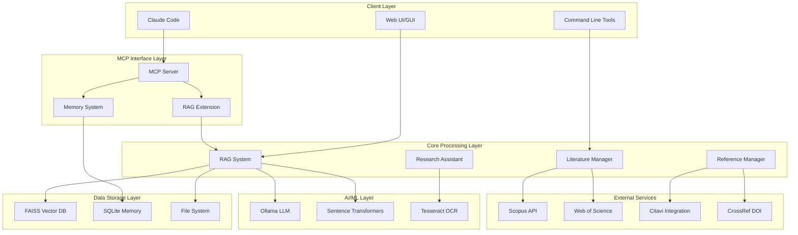

# System Architecture

## Overview

The Masterarbeit KI-Finance project is a comprehensive research automation environment designed for AI agent research in finance. It combines RAG (Retrieval-Augmented Generation) systems, literature management, and academic writing assistance through a modular, containerized architecture.

## High-Level Architecture



## Component Architecture

### 1. MCP Server Layer

**Primary Components:**
- `mcp_server.py` - Main MCP interface
- `mcp_server_rag_extension_improved.py` - Enhanced RAG functionality
- `memory_system.py` - Session persistence and context management

**Responsibilities:**
- Expose research tools to Claude Code via MCP protocol
- Handle document search and retrieval operations
- Manage persistent memory across sessions
- Coordinate between different system components

### 2. Core Processing Components

#### RAG System (`scripts/rag_system.py`)
- **Document Processing**: PDF text extraction with OCR fallback
- **Embedding Generation**: Sentence transformers for semantic search
- **Vector Storage**: FAISS for efficient similarity search
- **LLM Integration**: Ollama phi3:mini for intelligent responses

#### Literature Manager (`scripts/search_literature.py`)
- **Database Integration**: Scopus, Web of Science, ProQuest APIs
- **Quality Filtering**: Q1 journal filtering, impact factor validation
- **Search Optimization**: Multi-database query coordination
- **Result Validation**: Citation count and peer-review verification

#### Reference Manager (`scripts/manage_references.py`)
- **Citation Processing**: BibTeX parsing and validation
- **Citavi Integration**: Export to reference management software
- **Format Standardization**: APA7 citation formatting
- **DOI Verification**: CrossRef validation

### 3. Data Architecture

#### Vector Storage (FAISS)
```
indexes/
├── faiss_index           # Vector embeddings
├── metadata.json         # Document metadata
└── document_chunks.json  # Text chunk mappings
```

#### Document Storage
```
literatur/
├── finance/              # Domain-specific papers
├── methodology/          # Research methodology papers
└── test/                # Testing and validation documents
```

#### Configuration Management
```
config/
├── research-criteria.yaml    # Quality criteria and search parameters
├── rag_config.yaml          # RAG system configuration
├── writing-style.yaml       # Academic writing guidelines
└── ollama_config.yaml       # LLM model settings
```

## Service Architecture

### Containerized Services (Docker Compose)

#### Ollama Service
- **Image**: `ollama/ollama:latest`
- **Port**: 11434
- **Resources**: 4-12 CPUs, 4-16GB RAM
- **Models**: phi3:mini (2.2GB, CPU-optimized)
- **Configuration**: Keep-alive 24h, max 1 loaded model

#### MCP Server Service
- **Build**: Custom Dockerfile
- **Port**: 3001 (mapped from 3000)
- **Volumes**: Persistent data mounting for development
- **Dependencies**: Optional Ollama dependency
- **Health Checks**: HTTP endpoint monitoring

### Processing Pipeline

#### Document Indexing Pipeline
```
PDF Document → Text Extraction → OCR (if needed) → 
Text Chunking → Embedding Generation → Vector Storage → 
Metadata Indexing → Search Index Update
```

#### Research Query Pipeline
```
Research Query → Multi-DB Search → Quality Filtering → 
Result Aggregation → Metadata Extraction → 
Reference Formatting → Output Generation
```

#### RAG Query Pipeline
```
User Query → Vector Similarity Search → Context Retrieval → 
LLM Augmentation → Response Generation → Citation Formatting
```

## Integration Architecture

### MCP Protocol Integration
- **Tools**: Exposed as Claude Code tools via MCP
- **Memory**: Persistent session context
- **Error Handling**: Graceful degradation and fallbacks
- **Performance**: Caching and optimization

### External API Integration
- **Scopus**: Literature search and metadata
- **Web of Science**: Citation analysis
- **CrossRef**: DOI validation and metadata
- **Citavi**: Reference management export

### File System Integration
- **Volume Mounts**: Persistent data across container restarts
- **Hot Reloading**: Development mode with live code updates
- **Backup System**: Automated backup and restore functionality

## Security Architecture

### Data Protection
- **API Keys**: Environment variable management
- **File Access**: Sandboxed container execution
- **Network**: Isolated Docker networks
- **Validation**: Input sanitization and validation

### Access Control
- **Container Isolation**: Service-level separation
- **Volume Permissions**: Read-only and read-write segregation
- **Health Monitoring**: Service availability tracking

## Performance Architecture

### CPU Optimization
- **Multi-threading**: 4-16 thread PyTorch configuration
- **Batch Processing**: Optimized batch sizes for Ollama
- **Memory Management**: 80% maximum memory usage limits
- **Caching**: Response and embedding caching

### Scalability Considerations
- **Horizontal Scaling**: Container-based architecture
- **Resource Limits**: CPU and memory constraints
- **Load Balancing**: Multiple concurrent request handling
- **Storage Optimization**: Efficient vector index management

## Technology Stack

### Core Technologies
- **Python 3.10+**: Primary development language
- **PyTorch**: CPU-optimized ML operations
- **FAISS**: Vector similarity search
- **Sentence Transformers**: Text embedding generation

### ML/AI Stack
- **Ollama**: Local LLM serving
- **phi3:mini**: Lightweight language model
- **Tesseract OCR**: Document text extraction
- **spaCy**: Natural language processing

### Data Management
- **SQLite**: Session and memory persistence
- **JSON**: Configuration and metadata storage
- **YAML**: Human-readable configuration
- **BibTeX**: Citation format handling

### Infrastructure
- **Docker**: Containerization
- **Docker Compose**: Multi-service orchestration
- **Linux/WSL2**: Primary deployment environment
- **Git**: Version control and collaboration

## Development Architecture

### Code Organization
```
├── scripts/              # Core processing modules
├── config/               # Configuration management
├── memory/               # Session persistence
├── tests/                # Testing and validation
├── docs/                 # Documentation
└── venv/                 # Python virtual environment
```

### Testing Strategy
- **Unit Tests**: Component-level validation
- **Integration Tests**: End-to-end workflows
- **Performance Tests**: Load and stress testing
- **Validation Tests**: Academic standards compliance

This architecture provides a robust, scalable foundation for AI-powered academic research while maintaining clear separation of concerns and enabling efficient development workflows.